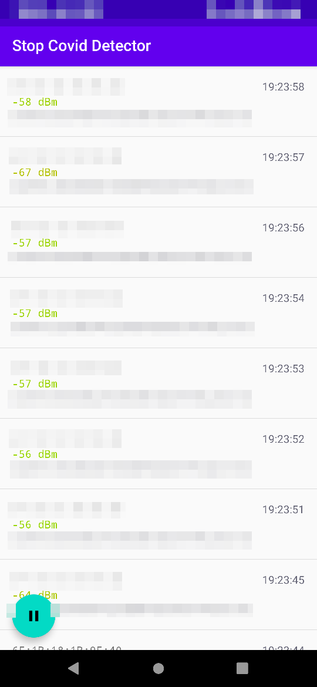

# Stop Covid Detector 3000

This app displays the beacons received by an android device that match the one sent by the Stop Covid app, an app of contact tracing made by the french government.

It uses the same kind of code as the one in use in the official app.

The UUID currently matched are:

- 910c7798-9f3a-11ea-bb37-0242ac130002, extracted from https://gitlab.inria.fr/stopcovid19/stopcovid-android/-/blob/master/stopcovid/build.gradle#L53
- 0000b81d-0000-1000-8000-00805f9b34fb, extracted from https://android.googlesource.com/platform/development/+/434d41c/samples/browseable/BluetoothAdvertisements/src/com.example.android.bluetoothadvertisements/Constants.java (used in screenshots from https://www.numerama.com/tech/626710-on-a-essaye-stopcovid-en-beta-sur-iphone-une-interface-efficace-pour-une-app-discutable.html )
- d61f4f27-3d6b-4b04-9e46-c9d2ea617f62, extracted from https://github.com/TCNCoalition/TCN/blob/main/README.md

## Usage

This app can be used to check whether the Stop Covid app is really working as intended (sending beacons), for example when your phone is in sleeping mode or in standby. Of course, you'd need another phone to check, as your phone cannot detect the beacons it sends.

You can also use this app to illustrate the inner working of the application, as it underlines it's possible to check (without any contact) if someone is using the Stop Covid application or not.

It can also be used to check if your phone changes of MAC address regularly to avoid tracking.

## Screenshots

